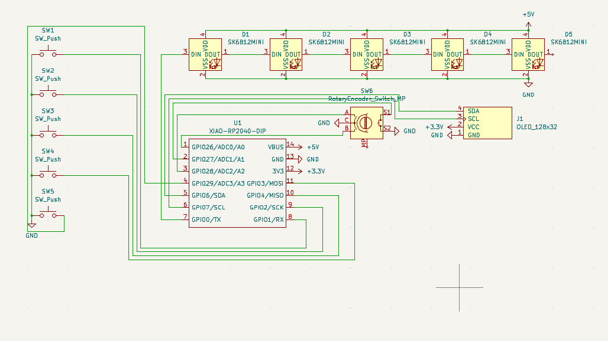

# Hackpad

This is my build journal and hardware design repo for the **[Hack Club Hackpad](https://hackpad.hackclub.com/)**, a macropad built using the Seeed XIAO RP2040.

### Schematic

## Bill of Materials (BOM)

| Qty | Name                       |
| --- | -------------------------- |
| 1   | Case top + bottom          |
| 1   | PCB                        |
| 1   | Seeed Studio XIAO RP2040   |
| 1   | 128x32 I2C OLED screen     |
| 5   | SK6812MINI-E LEDs          |
| 5   | Cherry MX-style switches   |
| 5   | Blank DSA white keycaps    |
| 1   | EC11 rotary encoder + knob |
| 4   | M3x16mm screws             |
| 4   | M3x5mx4mm heatset inserts  |
